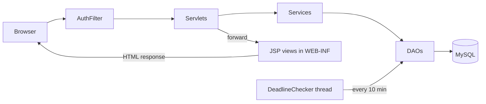
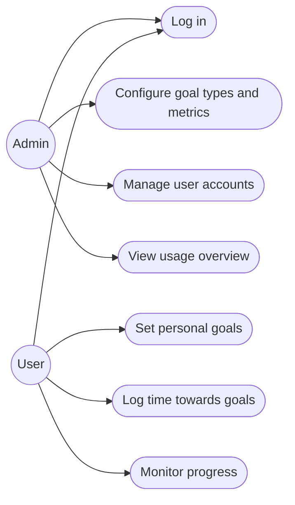
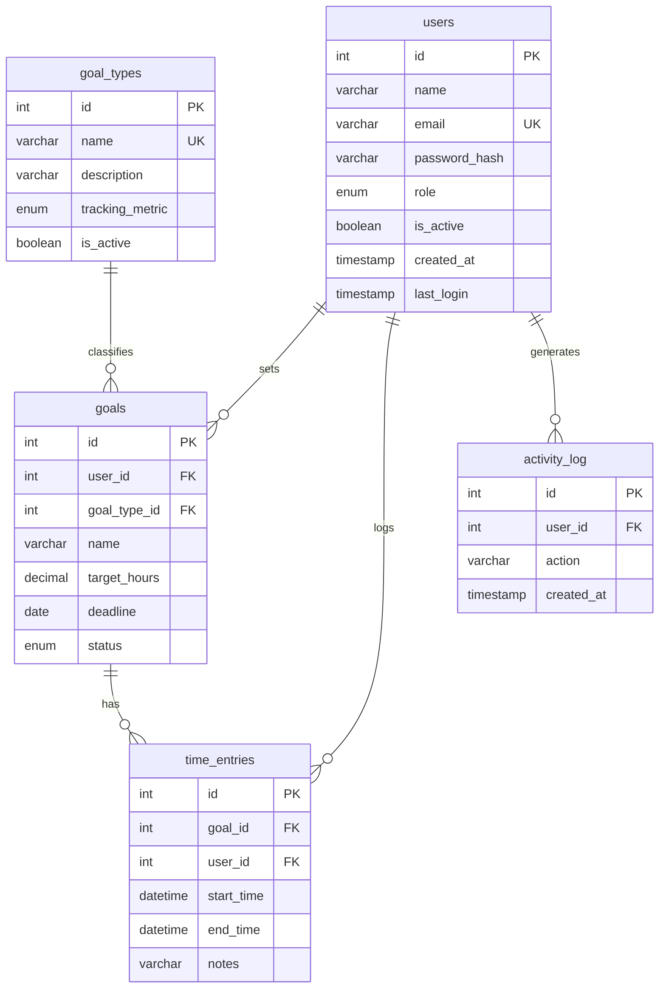

# Meridian Design

## Architecture

```mermaid
flowchart LR
    B[Browser] --> F[AuthFilter]
    F --> S[Servlets]
    S --> SV[Services]
    SV --> D[DAOs]
    D --> DB[(MySQL)]
    S -->|forward| J[JSP views in WEB-INF]
    J -->|HTML response| B
    T[DeadlineChecker thread] -->|every 10 min| D
```

## Use cases

```mermaid
flowchart LR
    A((Admin)) --> L([Log in])
    U((User)) --> L
    A --> A1([Configure goal types and metrics])
    A --> A2([Manage user accounts])
    A --> A3([View usage overview])
    U --> U1([Set personal goals])
    U --> U2([Log time towards goals])
    U --> U3([Monitor progress])
```

## Database

```mermaid
erDiagram
    users ||--o{ goals : sets
    goal_types ||--o{ goals : classifies
    goals ||--o{ time_entries : has
    users ||--o{ time_entries : logs
    users ||--o{ activity_log : generates

    users {
        int id PK
        varchar name
        varchar email UK
        varchar password_hash
        enum role
        boolean is_active
        timestamp created_at
        timestamp last_login
    }
    goal_types {
        int id PK
        varchar name UK
        varchar description
        enum tracking_metric
        boolean is_active
    }
    goals {
        int id PK
        int user_id FK
        int goal_type_id FK
        varchar name
        decimal target_hours
        date deadline
        enum status
    }
    time_entries {
        int id PK
        int goal_id FK
        int user_id FK
        datetime start_time
        datetime end_time
        varchar notes
    }
    activity_log {
        int id PK
        int user_id FK
        varchar action
        timestamp created_at
    }
```
